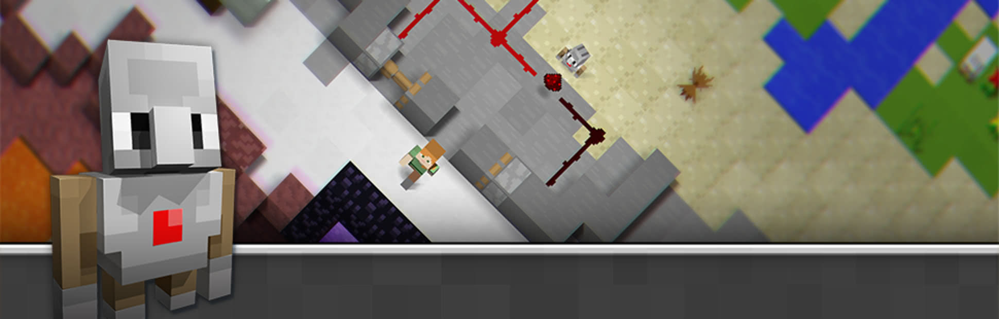

## Welcome to and Hour of Code at Waterford Institute of Technology!

The [Hour of Code](https://hourofcode.com/ie){:target="_blank"} started as a one-hour introduction to computer science, designed to demystify "code", to show that anybody can learn the basics, and to broaden participation in the field of computer science. It has since become a worldwide effort to celebrate computer science. 

We have been runnng Hour of Code activities in WIT for a number of years to show prospective students just how accessible computer programming can be.

### What To Do?!
We like to capture some anonymised data about people who complete an Hour of Code with us, to learn more about people's attitudes towards computer science. There's three simple steps to the activity, that should take you less than 60 minutes to complete.

1. Take the [BEFORE survey](https://www.surveymonkey.com/r/Q8JXPL8){:target="_blank"}
2. Complete the [Hour of Code exercise](https://studio.code.org/s/hero/stage/1/puzzle/1){:target="_blank"}
3. Complete the [AFTER survey](https://www.surveymonkey.com/r/QV96RJ7){:target="_blank"}

### Minecraft

We've used a number of Hour of Code exercises since WIT began participation. At the moment, we're working with the Minecraft Hero's Journey activity. The "Player" uses programming blocks and JavaScript to complete a series of puzzles and progress to the next level until completion.

### More Info
If you'd like more information about the computing courses available at WIT, we invite you to browse our [Department Website](https://www.wit.ie/schools/science/department_of_computing_maths){:target="_blank"}

